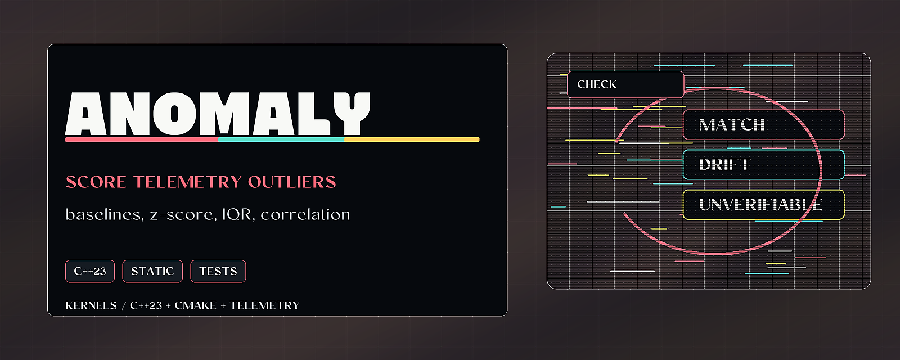

# Anomaly Kernels



> Score telemetry outliers with C++23 baselines, statistical detectors, and correlation windows.

Anomaly Kernels is a small C++23 library for detection analytics. It builds
baselines, scores new samples with z-score/IQR/percentile methods, correlates
alerts over time, and keeps the output narrow enough to review as evidence.

## Why it matters

AI and security workflows need fast local primitives for telemetry quality before
larger models or dashboards interpret the data. This repo provides reusable
kernels that can feed receipt-backed detection and validation pipelines.

## Try it

```bash
cmake -S . -B build
cmake --build build --config Debug
ctest --test-dir build -C Debug --output-on-failure
```

## What to test first

- Build the static library with CMake.
- Run the CTest suite.
- Link `anomaly-kernels.lib` and include headers under `include/anomaly/`.

## Current status

Windows x64 C++23 static library with tests, public claim files, and release
gates. It is telemetry analytics, not exploit or host-intrusion tooling.

## Existing technical notes

> C++23 anomaly-detection kernels: baselines, z-score/IQR, and temporal correlation. Builds as a Windows x64 static library.

[](LICENSE)

[](https://github.com/HarperZ9/anomaly-kernels/actions/workflows/ci.yml)

[](https://harperz9.github.io)

`anomaly-kernels` is a standalone, public blue-team telemetry-analytics
library. It publishes a compact set of statistical anomaly-detection kernels:

- baseline builder (per-metric mean / stddev / min / max profiling)
- scoring engine (z-score, IQR, percentile)
- temporal alert correlator (multi-signal fusion by time window)

It is designed for telemetry quality and detection analytics. It does not
include execution primitives, exploit chains, credential workflows, or any
host-intrusion / SOC threat taxonomy.

The C++ namespace for all public types is `anomaly`. It targets Windows
x64 and compiles as a `STATIC` library (`anomaly-kernels.lib`) — not a
header-only library. There is no CLI; you link the library and include
the headers under `include/anomaly/`.

## Usage

See [USAGE.md](USAGE.md) for the install/link line, the public API of all
three components, worked examples with expected output, and the runnable
demo in [`examples/demo.cpp`](examples/demo.cpp). Quick taste:

```cpp
#include <anomaly/baseline_builder.h>
using namespace anomaly;

BaselineBuilder builder;
builder.add_sample(MetricType::CpuUsage, 50.0);
builder.add_sample(MetricType::CpuUsage, 52.0);
auto baseline = builder.build(MetricType::CpuUsage);  // std::expected<Baseline, std::string>
```

## Gates

- Test gate: module-focused unit tests in `tests/`, wired into CTest.
- License gate: `LICENSE` present (MIT).
- Secret gate: no credentials, `.env`, keys, or auth files in this export.
- Claim gate: `PUBLIC-CLAIM.md` and `PUBLIC-DISCLAIMER.md` present.

## Build

Windows x64 only (the CMake configure step hard-fails elsewhere). The MSVC
generator is multi-config, so name the configuration explicitly:

```bash
cmake -S . -B build
cmake --build build --config Debug
```

This produces `build/Debug/anomaly-kernels.lib`.

## Test

```bash
cmake -S . -B build
cmake --build build --config Debug
ctest --test-dir build -C Debug --output-on-failure
```

---
**Zain Dana Harper** — small tools with explicit edges.
[Portfolio](https://harperz9.github.io) · [HarperZ9](https://github.com/HarperZ9)
<sub>Built with Claude Code; reviewed, tested, and owned by me.</sub>

## For developers

Keep the public README, build notes, and examples aligned with current behavior. Before opening a PR or pushing a release, run the local native verification path.

```bash
cmake -S . -B build
cmake --build build
ctest --test-dir build --output-on-failure
```
